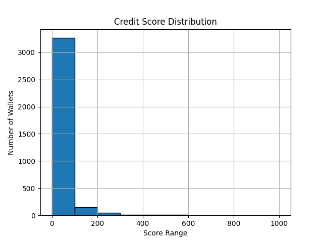

# 📊 Score Distribution

---

### 💡 Observations

- **0–100**: Wallets with high liquidation activity and low repayments — considered risky.
- **100–400**: Users with low engagement or some borrowing but poor repayment.
- **400–800**: Average users showing moderate-to-good deposit and repayment activity.
- **800–1000**: Highly responsible users — consistent deposits, regular repayments, and zero liquidations.
